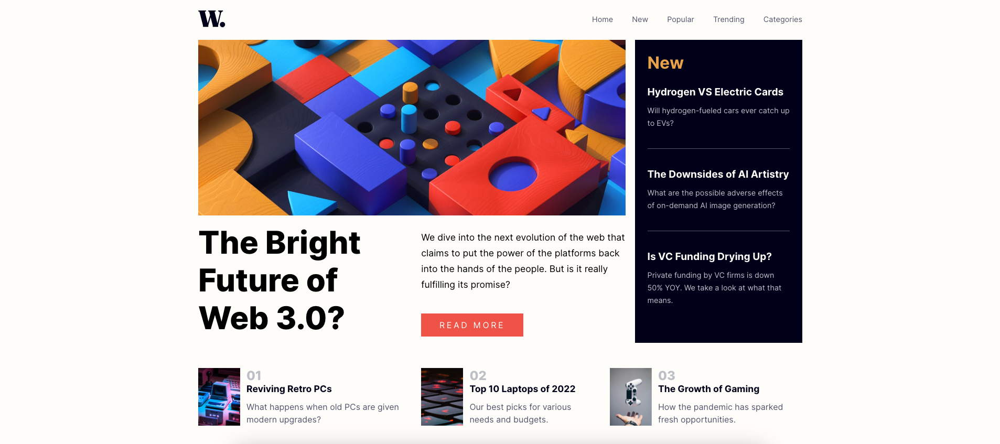
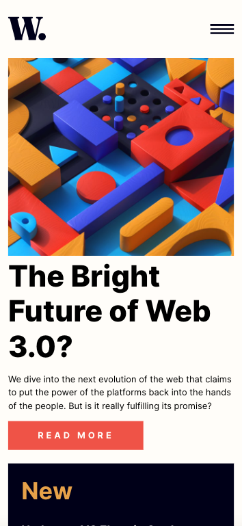

# Frontend Mentor - News homepage solution

This is a solution to the [News homepage challenge on Frontend Mentor](https://www.frontendmentor.io/challenges/news-homepage-H6SWTa1MFl). Frontend Mentor challenges help you improve your coding skills by building realistic projects.

## Table of contents

- [Overview](#overview)
  - [The challenge](#the-challenge)
  - [Screenshot](#screenshot)
  - [Links](#links)
- [My process](#my-process)
  - [Built with](#built-with)
  - [What I learned](#what-i-learned)
- [Author](#author)

## Overview

### The challenge

Users should be able to:

- View the optimal layout for the interface depending on their device's screen size
- See hover and focus states for all interactive elements on the page

### Screenshot

**Desktop:**



**Mobile:**



### Links

- Solution URL: [GitHub](https://github.com/dscorzoni/project-react-news-website)
- Live Site URL: [Netlify](https://project-news-react.netlify.app/)

## My process

### Built with

- Semantic HTML5 markup
- Flexbox
- [React](https://reactjs.org/) - JS library
- [Styled Components](https://styled-components.com/) - For styles

### What I learned

This project was very interesting to practice React and also it's my first time using Styled Components.

One interesting part was using react state to handle the menu in the mobile version with the onlick events, changing properties in the style to display or not the menu.

```jsx
const Header = () => {
  const [displayMenu, setDisplayMenu] = useState("none");

  const handleMenu = () => {
    displayMenu === "none" ? setDisplayMenu("block") : setDisplayMenu("none");
  };

  return (
    <HeaderBar>
      <Container>
        
        <NavBar>
          <a href="index.html">Home</a>
          <a href="index.html">New</a>
          <a href="index.html">Popular</a>
          <a href="index.html">Trending</a>
          <a href="index.html">Categories</a>
        </NavBar>
        
      </Container>
      <MobileNavBar style={{ display: displayMenu }}>
        <div className="left-menu">
          <div className="left-menu-header">
            
          </div>
          <div className="left-menu-body">
            <a href="index.html">Home</a>
            <a href="index.html">New</a>
            <a href="index.html">Popular</a>
            <a href="index.html">Trending</a>
            <a href="index.html">Categories</a>
          </div>
        </div>
      </MobileNavBar>
    </HeaderBar>
  );
};
```

## Author

- Website - [Danilo Scorzoni Ré](https://www.github.com/dscorzoni)
- Frontend Mentor - [@dscorzoni](https://www.frontendmentor.io/profile/dscorzoni)
- LinkedIn - [@dscorzoni](https://www.linkedin.com/in/dscorzoni/)
